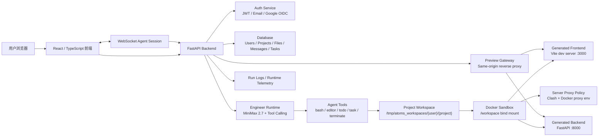

# Atoms

各位面试官好，感谢阅读这个项目。

我把 Atoms 做成了一个可以直接体验的 MVP：用户用自然语言描述想做的应用，Engineer Agent 在隔离 workspace 里生成前端、后端代码，系统再用 Docker sandbox 启动预览。

在线体验：[https://jackybigwang.site](https://jackybigwang.site)

测试账号：

```text
邮箱：test@atoms.demo
密码：test1234
```

为了节省您的时间，这个测试账号里已经有生成好的项目，可以直接打开项目、查看文件、查看 Agent 对话和预览结果。 您也可以自己注册账号，创建workspace进行完整体验～

## 项目定位


- 用户可以登录并管理自己的项目。
- 用户可以和 Engineer Agent 对话，让它生成或修改应用。
- Agent 会先给出 plan，用户 approve 后再写代码。
- 生成代码会落到项目 workspace，并持久化到数据库。
- 每个项目在独立 Docker 容器里启动 preview。
- preview 启动前会经过 health check 和 smoke check，尽量把不可运行的结果挡在预览前。

## 整体架构



### Workflow

```mermaid
sequenceDiagram
    participant U as User
    participant FE as Frontend
    participant BE as FastAPI Backend
    participant AG as Engineer Agent
    participant FS as Workspace
    participant DK as Docker Sandbox
    participant SM as Smoke Gate

    U->>FE: 输入需求
    FE->>BE: 创建 message + agent session ticket
    FE->>BE: WebSocket 连接
    BE->>AG: 注入项目上下文和工程约束
    AG->>U: draft_plan
    U->>AG: approve plan
    AG->>FS: 写 docs/plans 和应用代码
    AG->>BE: todo/task progress
    AG->>FS: backend import / frontend build 验证
    BE->>DK: start-preview
    DK->>DK: 安装依赖并启动前后端
    BE->>DK: health check
    BE->>SM: smoke checks
    SM->>BE: pass / fail
    BE->>FE: preview_ready / preview_failed
```



### 设计idea overview

1. 产品层：React 前端负责项目管理、对话、文件树、preview iframe 和实时状态展示。
2. 控制层：FastAPI 后端负责鉴权、持久化、Agent runtime、preview session、smoke gate 和 telemetry。
3. 执行层：Docker sandbox 负责真正运行用户生成的代码，和主系统隔离。

这样做的好处是：用户数据由后端统一保护，LLM 的写文件和跑命令被限制在 workspace 里，生成应用的依赖和进程被限制在 Docker 里，preview 也不直接暴露随机端口，而是通过后端发放的 session key 走同源反向代理。

## 技术栈

| 模块 | 技术选型 |
| --- | --- |
| 前端 | React 18, TypeScript, Vite, Tailwind CSS, Radix UI, Monaco Editor |
| 后端 | FastAPI, SQLAlchemy async, Pydantic v2 |
| 数据库 | SQLite 本地开发，PostgreSQL 生产可切换 |
| 认证 | JWT, bcrypt, Google OIDC, Resend Email |
| LLM Runtime | OpenAI-compatible client, MiniMax-M2.7, tool calling |
| Agent 工具 | bash, str_replace_editor, draft_plan, todo_write, task_update, load_skill, terminate |
| 沙箱 | Docker, Node 20, Python 3, pnpm, uv |
| Preview | start-preview, health check, smoke gate, same-origin preview gateway |
| 运维 | systemd, Nginx, Clash proxy policy, Docker build proxy |

## 登录功能实现

登录系统主要代码在：

- `app/backend/models/auth.py`
- `app/backend/services/auth.py`
- `app/backend/services/email_service.py`
- `app/backend/routers/auth.py`
- `app/frontend/src/contexts/AuthContext.tsx`
- `app/frontend/src/lib/auth.ts`

### 邮箱注册和常规登录

邮箱注册使用 email/password 模式：

1. 用户提交邮箱、密码和昵称。
2. 后端使用 bcrypt 对密码做 hash，不保存明文密码。
3. 用户 ID 使用 `email|{uuid}` 格式，和 OIDC 用户区分。
4. 新用户默认 `is_verified=false`。
5. 系统创建 `EmailVerificationToken`，有效期 24 小时。
6. `EmailService` 通过 Resend 发送验证邮件。
7. 用户点击验证链接后，后端把用户标记为已验证。
8. 常规登录时，后端会校验密码和 `is_verified`，通过后签发应用自己的 JWT。

忘记密码走类似流程：创建 `PasswordResetToken`，有效期 1 小时，使用后标记为 used，避免重复使用。

### Google 登录

Google 登录使用标准 OIDC Authorization Code + PKCE 流程：

1. 前端点击 Google 登录后跳转到 `/api/v1/auth/login`。
2. 后端生成 `state`、`nonce`、`code_verifier` 和 `code_challenge`。
3. 这些临时值存在 `oidc_states` 表里，防止 CSRF 和 nonce replay。
4. 用户在 Google 完成授权后，Google 回调 `/api/v1/auth/callback`。
5. 后端用 code 换 token，并通过 Google JWKS 校验 ID token。
6. 校验 issuer、audience、nonce、过期时间和签名。
7. 后端通过 Google sub 查找或创建用户。
8. 最后签发 Atoms 自己的 JWT，并 redirect 到前端 callback 页面。

前端拿到 JWT 后存到 `localStorage`，后续 API 请求通过 `Authorization: Bearer <token>` 鉴权。

### 国内网络和稳定性

因为服务器访问 Google、GitHub、npm、PyPI、模型 API 都可能受网络影响，我在服务器侧做了统一代理策略：

- 服务器出站走 Clash mixed port。
- 只选择新加坡、日本、台湾、美国、韩国的非直连稳定节点。
- 去掉直连节点、香港节点和不相关节点。
- Clash 的 Auto group 用 `url-test` 自动选择延迟最低节点。
- `tolerance` 设置为 `500ms`，只要当前节点延迟不高于 500ms 就不频繁切换，优先稳定性。
- Docker daemon、sandbox build、git fetch、sandbox runtime 都显式接入代理环境变量。

这部分脚本和说明在：

- `scripts/configure-server-clash-policy.sh`
- `scripts/build-atoms-sandbox.sh`
- `docs/server-operations.md`

LLM runtime 里也有一个小的稳定性处理：tokenizer 优先使用 `tiktoken`，如果因为网络或包数据问题不可用，会退回到本地字符估算，避免因为 tokenizer 下载失败导致 Agent 不能工作。

## LLM Runtime 设计

核心代码位置：

- `app/backend/openmanus_runtime/llm.py`
- `app/backend/openmanus_runtime/agent/base.py`
- `app/backend/openmanus_runtime/agent/toolcall.py`
- `app/backend/openmanus_runtime/streaming.py`
- `app/backend/openmanus_runtime/tool/`
- `app/backend/services/engineer_runtime.py`
- `app/backend/services/approval_gate.py`
- `app/backend/services/agent_task_store.py`
- `app/backend/services/runtime_telemetry.py`

### 1. 大模型接入

Atoms 使用 OpenAI-compatible client 接入大模型，默认配置是 MiniMax 2.7：

```env
APP_AI_BASE_URL=https://api.minimax.chat/v1
APP_AI_DEFAULT_MODEL=MiniMax-M2.7
APP_AI_KEY=your-minimax-api-key
```

`openmanus_runtime/llm.py` 封装了模型调用：

- 普通文本调用：`ask`
- 图文调用：`ask_with_images`
- 工具调用：`ask_tool`

工具调用使用非 streaming 请求，因为模型需要一次性返回完整 `tool_calls`。前端看到的“流式体验”由 runtime 把 assistant message、progress、terminal log、task update 等事件通过 WebSocket 推送出来。

模型错误处理也做了区分：例如 429、408、409 可以 retry；明显的 400 bad request 不会盲目重试，而是交给 runtime 判断是否能自愈。

### 2. 工具选择和工具设计


| 工具 | 用途 |
| --- | --- |
| `draft_plan` | 先生成 3-7 项计划，并等待用户 approve |
| `str_replace_editor` | 查看、创建、替换、插入 workspace 内文件 |
| `bash` | 在 sandbox/workspace 上下文里运行命令 |
| `todo_write` | 初始化 Agent checklist |
| `task_update` | 更新任务状态 |
| `load_skill` | 按需加载技能说明 |
| `terminate` | 明确结束本轮任务 |

工具层做了几类工程限制：

- 写文件必须在 `/workspace` 内，不能逃逸到宿主机路径。
- `bash` 会拦截高风险 inline 写文件方式，要求通过 editor 工具改文件。
- 常见安装命令会被 rewrite 到 `atoms-deps-cache`，避免每次 preview 都重新安装依赖。
- `todo_write` 最多 8 个任务，且同时只能有一个 `in_progress`。
- blocked task 不能被直接标记为进行中或完成。
- 静默工具不会刷屏到前端，但会更新任务、进度和 telemetry。

这个设计的目标是让 Agent 仍然有足够自由度完成真实工程任务，但不能无限制地写文件、乱跑命令或绕过用户 approve。

### 3. Prompt 位置和设计原因

Prompt 分两层。

第一层是基础 SWE prompt：

- `app/backend/openmanus_runtime/prompt/swe.py`

它定义 Agent 是命令行环境里的软件工程师，必须使用工具查看和修改文件，避免假装完成。

第二层是项目级动态 prompt：

- `app/backend/services/engineer_runtime.py`

这里会把当前 project、workspace 约束、preview contract、生成规范、验证命令和 workflow 一起注入给 Agent。重要约束包括：

- 必须在 `/workspace` 下工作。
- 必须先调用 `draft_plan`，等待用户 approve。
- approve 后必须写详细计划到 `docs/plans/{YYYY-MM-DD}-{feature}.md`。
- React 前端调用后端时不能写死 localhost，必须使用 `VITE_ATOMS_PREVIEW_BACKEND_BASE`。
- 如果生成 backend，必须提供 `/health`。
- 如果 backend 有 `/health` 之外的 API route，必须创建 `.atoms/smoke.json`。
- PNG 接口 smoke 必须检查 `content_type=image/png` 和 PNG base64 prefix `iVBORw0KGgo=`。
- Backend import 验证必须使用 runtime 指定命令，避免路径和 venv 不一致。

这个 prompt 的设计思路是：不要只告诉 LLM “你要写好代码”，而是把平台运行时的硬性契约写进任务说明里，让 Agent 生成的代码更容易被 Docker preview 和 smoke gate 接住。

### 4. Memory 设计

Atoms 目前有三类 memory：

1. 对话和项目文件的持久化 memory。
   - `messages` 表保存用户和 assistant 消息。
   - `project_files` 表保存项目文件快照。
   - 项目再次打开时，可以恢复对话、文件树和上下文。

2. 单次 Agent run 的短期 memory。
   - `openmanus_runtime/schema.py` 里的 `Memory` 保存本轮消息。
   - ToolCallAgent 根据这些消息决定下一步工具调用。

3. 工程任务 memory。
   - `agent_tasks` 保存 checklist/task 状态。
   - run logs 保存 `latest.json`、`latest.jsonl` 和 `latest_metrics.jsonl`。
   - telemetry 记录 bash、dependency、preview、smoke、verification 等事件。


### 5. 自动 compact 策略

长任务会导致上下文膨胀，runtime 里做了两层 compact：

1. micro compact
   - 保留最近几个 tool 结果。
   - 旧的长 tool output 会被替换成短摘要，例如“之前使用过某工具”。
   - 对 `read_file` / `view_file` 这类关键文件读取结果更保守，避免丢掉工程上下文。

2. auto compact
   - 当估算 token 超过约 50k 时触发。
   - 保留第一条任务消息和最近几条消息。
   - 中间历史交给 LLM 总结成 compact summary。
   - summary 要覆盖已完成工作、当前状态、关键决策、剩余任务和用户约束。

这不是为了节省 token 而随便裁剪，而是为了在长任务里保留“现在做到哪、为什么这么做、下一步是什么”。

### 6. Task system 如何防止 Agent 偷懒

Atoms 对 Agent 的约束不是只靠 prompt，而是靠 runtime gate：

- 没有 `draft_plan` approval，写操作会被 `approval_gate` 拦截。
- approve 后还必须写 `docs/plans/*.md`，否则实现阶段写操作仍然会被拦。
- `todo_write` / `task_update` 把任务状态落库，前端实时展示 checklist。
- 同一时间只能有一个任务 `in_progress`，减少“全部标完成”的假进度。
- backend import check 会在完成前重新跑；失败会把错误反馈给 Agent 修复。
- preview 会先跑 health check。
- 如果 backend 暴露业务 API，必须有 `.atoms/smoke.json`，并且 smoke 失败会 fail closed。
- 工具调用 JSON 出错时，runtime 会把明确错误喂回同一个 Agent，让它自修，而不是简单 retry 或直接失败。

所以这里的策略是：Prompt 负责告诉 Agent 怎么做，工具和 gate 负责强制它按工程流程做。

## 数据持久化和隔离

### 数据库持久化

后端使用 SQLAlchemy async，开发环境可以用 SQLite，生产环境可以切到 PostgreSQL。主要持久化对象包括：

- `users`
- `user_profiles`
- `projects`
- `project_files`
- `messages`
- `agent_tasks`
- `workspace_runtime_sessions`
- `email_verification_tokens`
- `password_reset_tokens`
- `oidc_states`

每个项目的文件会在数据库里保存一份，同时 materialize 到宿主机 workspace 目录，供 Docker sandbox bind mount 使用。

### 账号数据隔离

主路径 API 都依赖 `get_current_user` 解析 JWT，并且用 `user_id` 过滤数据：

- 项目列表只查当前用户项目。
- 项目详情要求 `project.user_id == current_user.id`。
- 文件、消息和任务都带 `user_id` / `project_id`。
- `projects` 表对 `(user_id, project_number)` 做唯一约束，保证不同用户可以有自己的项目编号空间。

项目 workspace 路径也是按用户和项目隔离：

```text
/tmp/atoms_workspaces/{user_id}/{project_id}
```

Docker 容器按项目创建，并把这个目录挂载为：

```text
/workspace
```

这样 Agent 和 generated app 只能看到当前项目 workspace。

### Docker sandbox 设计

每个项目有独立容器，使用同一个 `atoms-sandbox:latest` 镜像：

- 镜像内置 Node 20、Python 3、pnpm、uv 和常用 Python 包。
- 容器启动后保持 `sleep infinity`，preview 时再 exec `start-preview`。
- 前端默认运行在容器内 3000 端口。
- 后端默认运行在容器内 8000 端口。
- 宿主机用随机端口映射，避免项目之间冲突。
- 后端通过 Docker API 获取映射端口，再发放 preview session。
- 用户访问的是 `/preview/{session_key}/frontend/` 和 `/preview/{session_key}/backend/`，不是直接访问容器端口。

依赖安装通过 `atoms-deps-cache` 做缓存：

- 前端根据 `package.json`、lockfile hash 判断是否复用 `node_modules`。
- 后端根据 `requirements.txt`、`pyproject.toml`、`uv.lock` hash 判断是否复用 `.venv`。
- Agent 在 bash 里常见的 `pnpm install`、`uv pip install` 也会被 rewrite 到这个 wrapper。

## Preview 和 Smoke Gate

生成项目必须提供 `.atoms/preview.json`，告诉平台如何启动前端和后端。`start-preview` 读取这个文件后：

1. 安装或复用前端依赖。
2. 安装或复用后端依赖。
3. 注入 `ATOMS_PREVIEW_FRONTEND_BASE`、`ATOMS_PREVIEW_BACKEND_BASE`、`VITE_ATOMS_PREVIEW_BACKEND_BASE`。
4. 启动前端 dev server。
5. 启动后端 server。
6. 后端 runtime 等待 health check。
7. 如果需要，运行 `.atoms/smoke.json`。
8. 全部通过后发送 `preview_ready`。

Smoke gate 的规则比较严格：

- 如果 backend OpenAPI 里发现 `/health` 以外的业务 API，就要求 workspace 里存在 `.atoms/smoke.json`。
- OpenAPI 解析失败、非 200、schema 异常都会 fail closed。
- PNG 响应可以检查 `content_type=image/png` 和 body base64 prefix。
- smoke 失败时不会把 preview 当成成功。

这是为了避免“页面看起来启动了，但核心 API 根本不能用”的情况。


## 当前 MVP 的边界

Atoms 已经跑通了从登录、项目管理、Agent 编码、Docker preview 到 smoke gate 的主链路，但它仍然是 MVP。

我会特别说明一个工程边界：主业务 API 已按 `current_user` 做了用户隔离，但代码库里还有一些早期生成的通用 CRUD `/all` 类接口，需要在下一阶段收紧或下线。面试场景下我更希望把这个问题明确暴露出来，而不是假装它不存在。

## 未来可以提升的点

### 1. 用 templates / skills 提升生成稳定性

完全依赖 Agent 从零生成前后端，稳定性不够。更好的方式是由系统分发稳定模板，例如：

- React + Vite 基础模板
- FastAPI 基础模板
- preview contract 模板
- smoke contract 模板
- 常见登录、表单、图表、文件上传模块

Agent 只负责生成真正有创造性的业务部分。模板化代码由系统直接落盘，可以显著降低 one-shot 失败率。

### 2. 实现真正的 Agent teams

目前系统里主要是 Engineer Agent。后续可以加一个 Leader / Orchestrator：

- Leader 负责理解需求、拆任务、决定是否需要前端、后端、测试、设计等角色。
- Engineer 负责编码。
- Reviewer 负责检查 contract、测试和安全问题。
- Debugger 负责根据 runtime error 做定向修复。

这样可以从“一个 Agent 完成所有事”升级为“多角色协作完成复杂工程”。

### 3. 做系统化 eval 和安全收敛

现在 smoke gate 已经能挡住一部分运行时问题，但还不够系统。下一步我会做：

- 固定 benchmark prompts，覆盖 CRUD、图像生成、文件上传、图表、后端 API 等场景。
- 每次 runtime/prompt 改动后自动跑生成质量回归。
- 把 preview failure、smoke failure、tool JSON error、dependency install error 结构化入库。
- 用统计结果反推 prompt、模板、工具和 sandbox 的改动。
- 收紧 legacy `/all` 接口和 admin-like endpoint，保证所有数据访问都有明确权限边界。

这一步能把 Agent 平台从“看起来能跑”推进到“可持续迭代、可衡量质量”。

## 总结

Atoms 这个 MVP 想展示的是一个完整闭环：用户提出需求，Agent 规划并编码，系统隔离运行，preview 和 smoke gate 验证结果，所有过程实时可见并可追踪。

我没有把重点放在做更多页面功能，而是放在应用生成平台最关键的工程问题上：鉴权、隔离、工具约束、长上下文、任务推进、依赖安装、preview、smoke、自愈和 telemetry。
